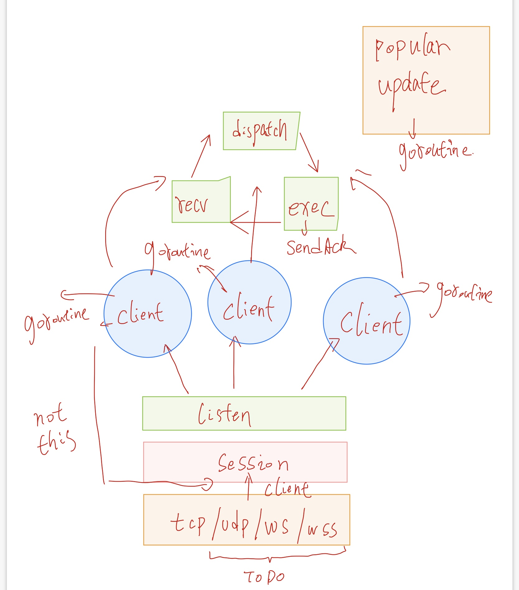

[![Build Status][1]][2] [![Go Report Card][3]][4] [![Coverage Statusd][5]][6]
# chat-test-golang

## 介绍：

简单的聊天服务以及配套的客户端

## 如何使用

####  Install：

​	你需要到 https://golang.org/dl/ 下载你的系统对应的golang编译环境。支持最新的golang 版本 ，低版本可能会遇到未知的问题（最低测试到 1.13）。

​	然后按顺序执行以下命令:

```shell
git clone https://github.com/nerored/chat-test-golang.git
cd chat-test-golang
make
```

### Server:

​	继续在刚刚安装完成的目录下，server和client均会编译到 /bin 目录中。

```shell
NAME:
   chat-test-service - A new cli application

USAGE:
   server [global options] command [command options] [arguments...]

COMMANDS:
   help, h  Shows a list of commands or help for one command

GLOBAL OPTIONS:
   --listen value          listen address (default: ":9527")
   --profanitywords value  load profanitywords (default: "./list.txt")
   --help, -h              show help (default: false) 
```

只是运行的话不需要调整任何参数（client 端口暂时写死了，没有弄成参数）

```shell
./bin/server
```

执行以上命令，就能将server运行起来了。默认server 监听的端口为 9527。

### Client:

```shell
NAME:
   chat client - chat client

USAGE:
   client [global options] command [command options] [arguments...]

COMMANDS:
   quit
   send
   popular
   stats
   help, h  Shows a list of commands or help for one command

GLOBAL OPTIONS:
   --help, -h  show help (default: false)
```

启动client，需要先运行server，不然会执行失败（无法连接）

```shell
./bin/client
```

与server不同，client为交互模式，链接成功后需要先输入自己的名字（ex:nerored)。server确认后，可以进行接下来的步骤。

client 支持命令行的补全。如果你不知道命令，可以敲入 help，来查看完整的命令列表。不清楚命令的参数时，也可以 在命令中 使用 -h / --help 来查看关于这个命令的帮助。

client 还支持命令历史记录，可以用 [方向键上]来检索之前敲过的命令，同时历史输入也会自动出现在补全之中。

#### 发送消息：

```
NAME:
   client send -

USAGE:
   client send [command options] [arguments...]

OPTIONS:
   --toname value, -n value   接收方Name
   --message value, -m value  要发送的消息
   --help, -h                 show help (default: false)
```

#### 查询用户：

```
NAME:
   client stats -

USAGE:
   client stats [command options] [arguments...]

OPTIONS:
   --username value, -n value  需要查询的用户Name
   --help, -h                  show help (default: false)
```

#### 最流行的词汇：

```
NAME:
   client popular -

USAGE:
   client popular [command options] [arguments...]

OPTIONS:
   --help, -h  show help (default: false)
```


## 架构设计



#### net:

网络部分设计为2层结构：

client：负责屏蔽不同底层协议的区别（当前使用tcp，可以通过实现net.Conn 来支持各种协议）。同时进行网络包的组包以及分包逻辑。

session: 用于维护整个通信过程。实现握手，加解密等业务层功能。同时简化了对应用层的API。

#### service:

每个登陆用户执行一个goroutine（非actor模型）。通过protobuf来进行协议管理。

## 其他细节

1.log包

log包实现了一套便于term中查看实时日志的一套输出流出。支持所有终端显示格式，且可以在单行日志中任意组合。

2.cli包

cli包简化了终端工具交互开发的过程，通过注册command便可以拥有自动补全，命令提示等等功能。

## 引用

 

```go
 	github.com/c-bata/go-prompt v0.2.3                        // client用于终端交互，在cli引用
    github.com/templexxx/xorsimd v0.4.1                       // 加密，aes加密代码来自于 github.com/xtaic/kcptun
    github.com/urfave/cli/v2 v2.2.0                           // linux风格参数解析
    golang.org/x/crypto v0.0.0-20200820211705-5c72a883971a    // 加密
    google.golang.org/protobuf v1.25.0                        // 用于协议管理

    //note:所有外部包均可以在 go.mod 中查看，其他未列出来的部分为上述包内部使用的依赖。
```
[1]: https://travis-ci.org/nerored/chat-test-golang.svg?branch=master
[2]: https://travis-ci.org/nerored/chat-test-golang
[3]: https://goreportcard.com/badge/github.com/nerored/chat-test-golang
[4]: https://goreportcard.com/report/github.com/nerored/chat-test-golang
[5]: https://codecov.io/gh/nerored/chat-test-golang/branch/master/graph/badge.svg
[6]: https://codecov.io/gh/nerored/chat-test-golang
